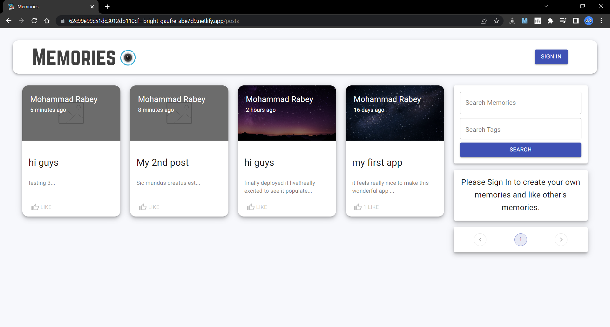

# Memories



## Introduction
This is a full stack application that allows users to 
- post interesting memories of thier choice
- view , like and comment other posts & (delete own post)  
- search for a post
- also find posts from a has a certain hashtag for easy convinience

## Tech stack
- Node.js
- Mongo.db
- React
- oAuth for (authentication)

## Deployment

- deployed frontend using netlify
- backend using heroku
- [Link to the deployed website](https://62c99e99c51dc3012db110cf--bright-gaufre-abe7d9.netlify.app)

## Setup

- paste your mongo uri in [index.js](server/index.js)

- configure your oauth id in google cloud dashboard and paste the client id in [Auth.js](client/src/components/Auth/Auth.js)

- run ```npm i && npm start``` for both client and server side to start the app

## Login


- login page with normal as well as google authentication 

## Dash board


- dashboard to view all posts

## Posts


- page to view each post seperartely ,comment and like

# Search


- demonstrating the usage to search feature in which user can find relevant pages according to the search query


# Hope you liked my project 